## Premade Qt project to quickly test qml-box2d on desktop and mobile (eg. iOS and to some degree Android)

### Overview:
This project is intended to allow you to quickly try out the examples provided by the qml-box plugin without installing the lib and without using qmlscene.
Instead, qml-box2d gets compiled as a static plugin, so that the qml-box2d-examples can also be tested on Apple iPad and Android tablets without hassle.

### Similar repo with Google LiquidFun integration:
You can find a similar repo but with additional LiquidFun integration here:
https://github.com/ThomasVogelpohl/qml-box2d-liquidfunexamples.git

### Caveats:
* The iPads Retina display does still use 1024x768 pixels and therefore the examples are full screen. Android tablets address the full resolution and therefore the examples are currently shown half size on android tablets.
* Included the qml-box2d in this repo instead of just adding the qml-box2d repo as submodule. Reason: As the plugin/plugin has been linked statically, to avoid collision with existing qml-box2d libaries on your system, the static version has been called Box2DStatic. Therefore I changed the includes  to pull in Box2DStatic.
* The qml-box2d and Box2D code are not changed, but I changed the examples to be better displayed on 1024x768 iPad screen.

### The qml-box2d plugin:
qml-box2d is a full-featured Qt plugin allowing access to the powerful C++ Box2D physics libary from Qt-QML. Use simple QML commands to create Box2D bodies, joints, sensors etc.
The qml-box2d plugin is very user friendly, just try it out !

Find the qml-box2d plugin here:
https://github.com/qml-box2d/qml-box2d

### Build the project:
Just load the qml-box2d-example.pro file into QtCreator and compile for desktop, iOS or Android.
start the examples with clicking RUN in QtCreator.

### iPad screenshots:
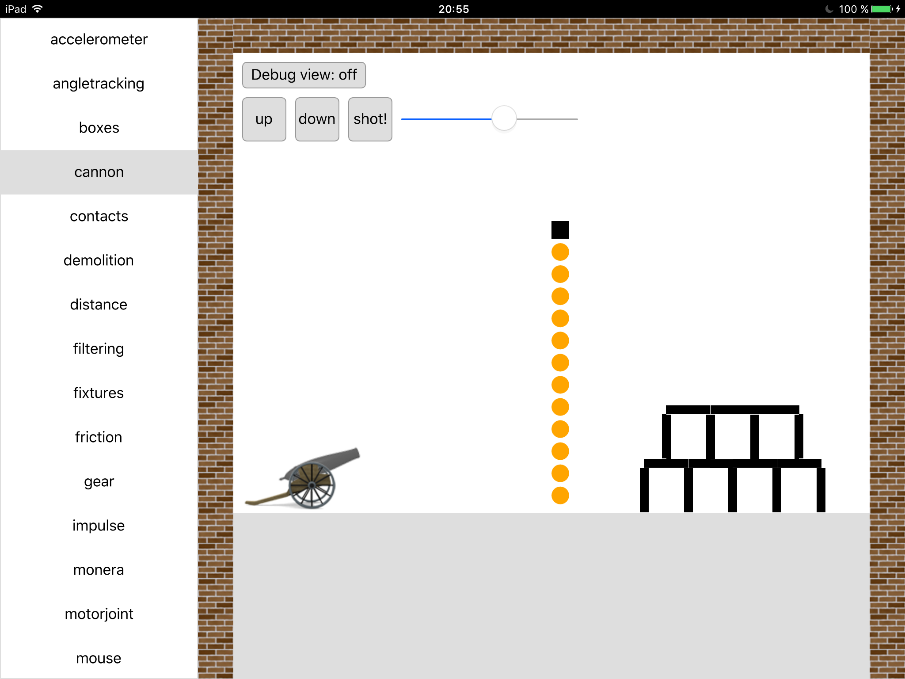
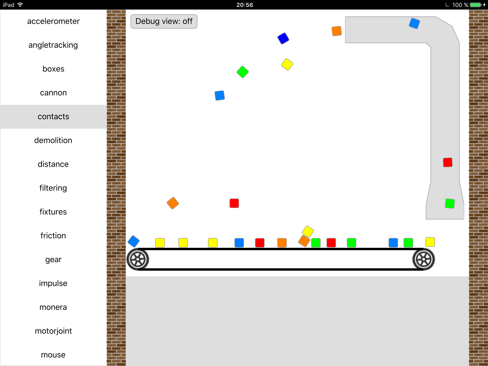
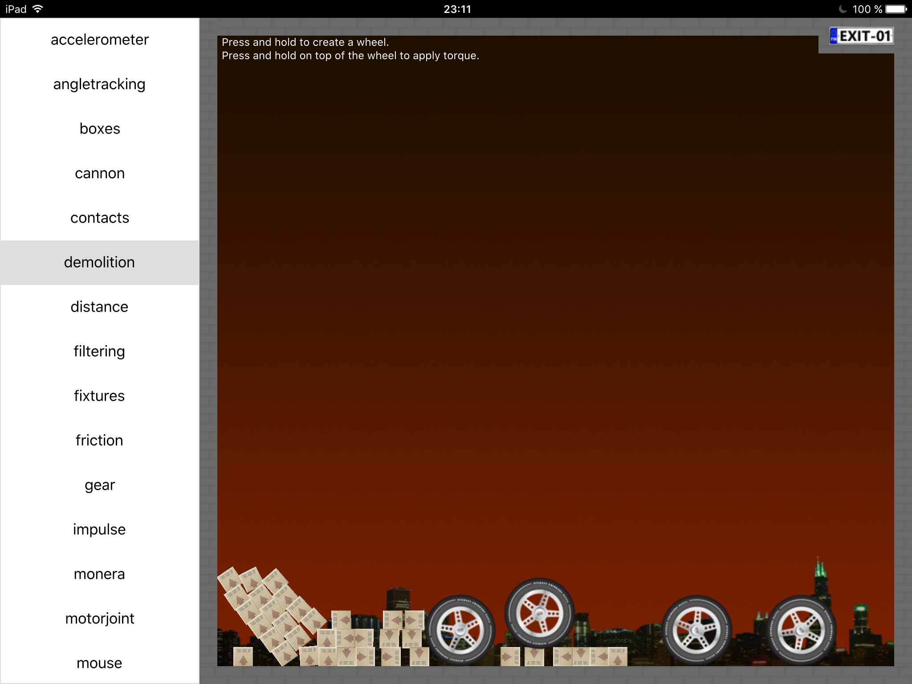
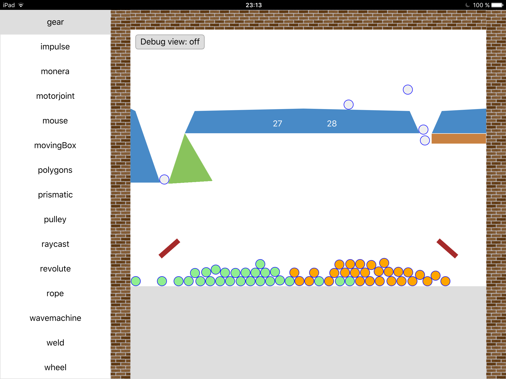
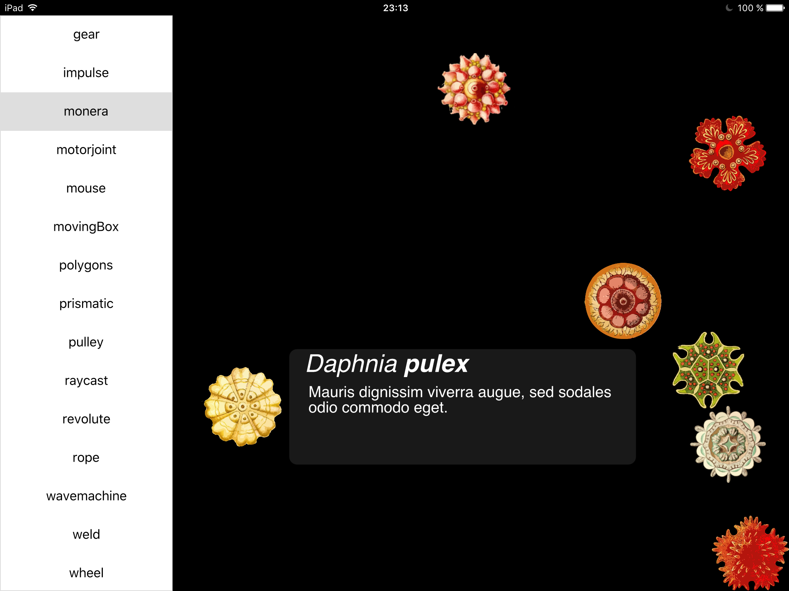
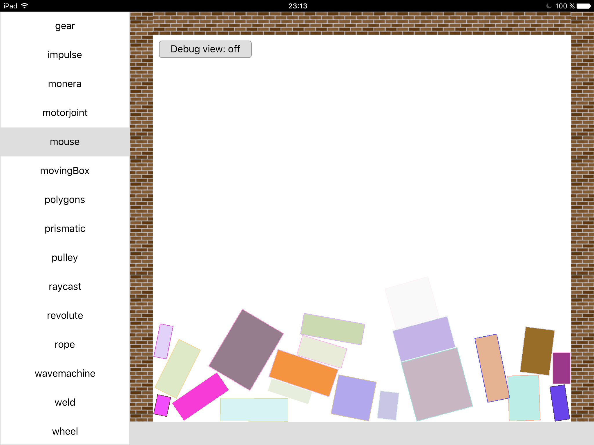
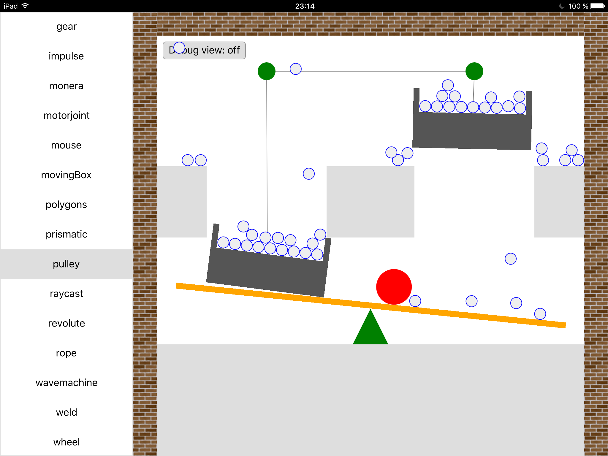
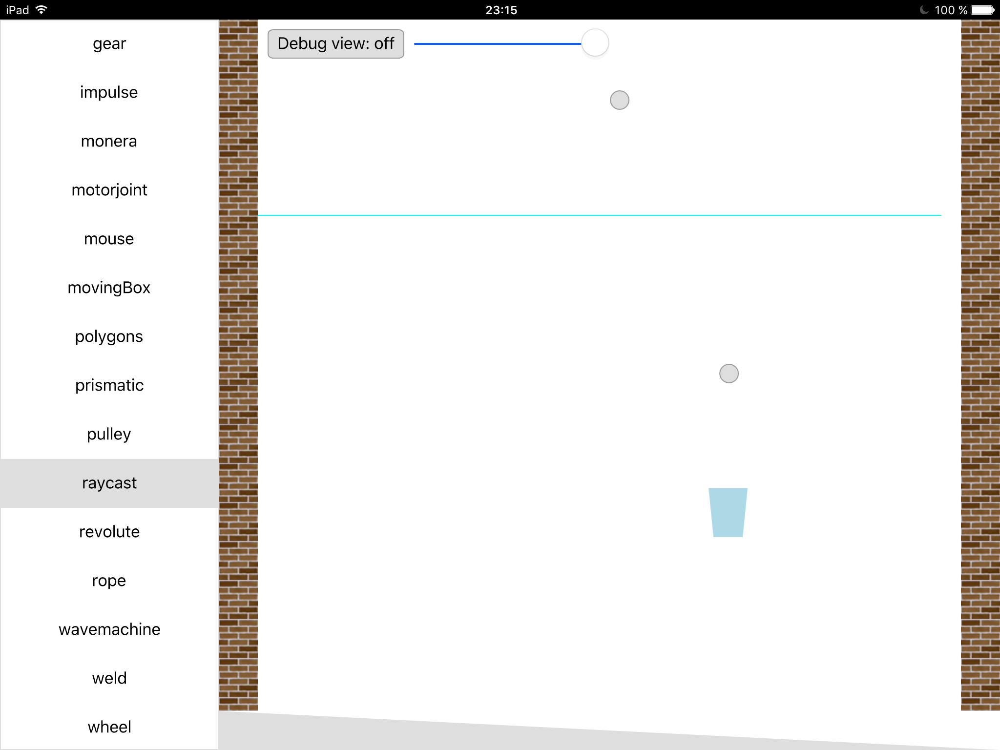
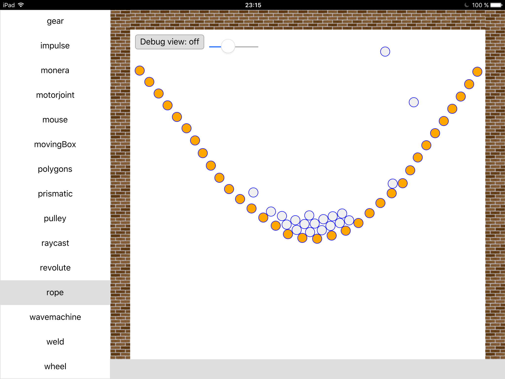
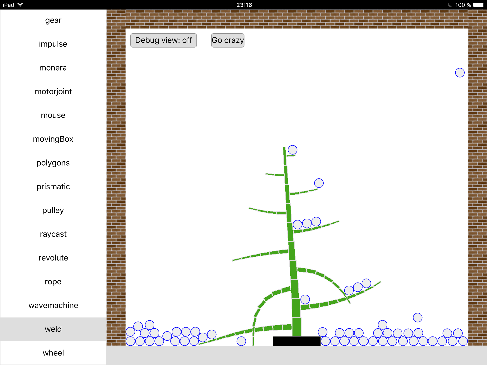
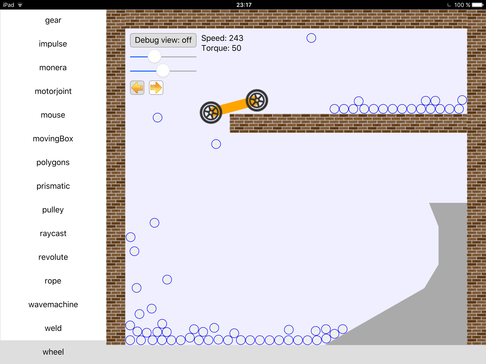